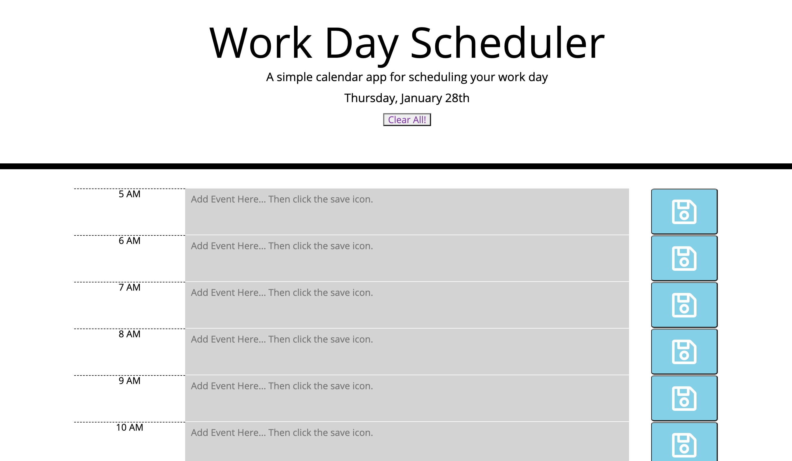
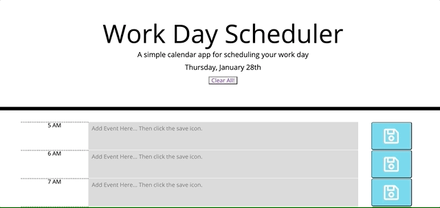
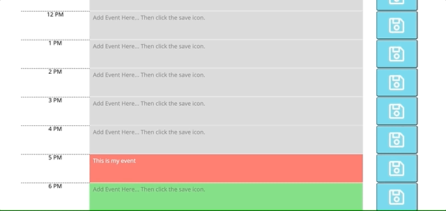

# Schedule Your Day

## Description
---
A simple calendar application, which allows users to save events for each hour of the day. It is perfect for scheduling your work day, or any type of scheduling needs. I wanted to create something that would help keep my day organized and to keep me on schedule, during my days. It is simple to use and you can save your event, in-case you need to exit or it closes by accident. Just come back to it.

    Some of the concepts I learned: 
    * how to use this
    * how to getItem and setItem with jquery

    I further understood:
    * jquery
    * getting items with jquery
    * retrieving local and global variables

url: https://dorley1993.github.io/Schedule_Your_Day/

## Table of Contents
---
* [Languages](#Languages)
* [Usage](#Usage)
* [License](#License)

## Languages
---
* JavaScript
* HTML
* CSS

    Libraries used:
    * jquery
    * bootstrap
    * moment
    * fontawesome

## Usage
---

When opening the website you will see the the day.

The date changes each day, matching the current date. A clear button to clear the pages stored data and text area. The hours are from 5AM to 6PM, since some people's work day start earlier than others. On the right is the save button, with a save icon. Click to save the event. The textarea color changes depening on the day. Grey for past, peach-red for present and green for the future. 

 

 

 
Below shows that you can reload the page and the event will still be there. 
 

 

## License
---
Copyright © Danielle Orley 

Permission is hereby granted, free of charge, to any person obtaining a copy of this software and associated documentation files (the "Software"), to deal in the Software without restriction, including without limitation the rights to use, copy, modify, merge, publish, distribute, sublicense, and/or sell copies of the Software, and to permit persons to whom the Software is furnished to do so, subject to the following conditions:

The above copyright notice and this permission notice shall be included in all copies or substantial portions of the Software.

THE SOFTWARE IS PROVIDED "AS IS", WITHOUT WARRANTY OF ANY KIND, EXPRESS OR IMPLIED, INCLUDING BUT NOT LIMITED TO THE WARRANTIES OF MERCHANTABILITY, FITNESS FOR A PARTICULAR PURPOSE AND NONINFRINGEMENT. IN NO EVENT SHALL THE AUTHORS OR COPYRIGHT HOLDERS BE LIABLE FOR ANY CLAIM, DAMAGES OR OTHER LIABILITY, WHETHER IN AN ACTION OF CONTRACT, TORT OR OTHERWISE, ARISING FROM, OUT OF OR IN CONNECTION WITH THE SOFTWARE OR THE USE OR OTHER DEALINGS IN THE SOFTWARE.
